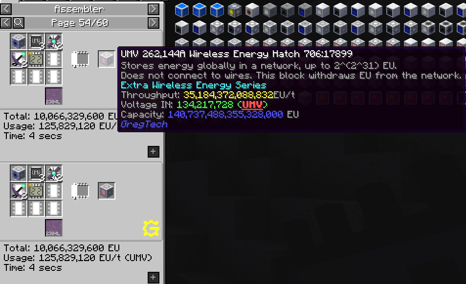

# Nyx: 没有人类了

[English](README.md) | 中文

WIP重构阶段。

随便整的私货，主要是因为当年搓星门搓的太累了。

这玩意儿更像是个**作弊Mod**。技术力和平衡是不存在的，自己玩的爽了就行。

> [!NOTE]
> 如上所述，这个Mod并不是为了平衡而生的。
> 如果你想要一个平衡的体验，请不要使用这个Mod。
>
> 祝你玩得开心！

## 功能

功能可能需要在`config\Nyx\*.cfg`配置文件中启用。

- 一些简单的材料系统，未来可能会用到。

- Mixin修改：参见配置文件`MIXIN.cfg`以获取更多详细信息。主要用于AE和BartWorks（现在在GT5U中）。

- 添加了IV~UMV无线激光，以及所有无线能源仓的简单配方。**配置: `RECIPE_EASY_WIRELESS`**

- COPIER：复制控制器中的物品

  **配置：`MTE_COPIER`**

> 按钮用于切换物品和流体的模式。
> 物品模式可以复制控制器中的物品，流体模式则是复制单元中的流体。
>
> 文本框用于设置要复制的物品或流体的数量。
>
> 每5秒工作一次，可以在配置中通过`MTE_COPIER_TICK`进行更改。

- PROXY：通过使用RecipeMap代理机器

  **配置：`MTE_PROXY`**

> 注意：它适用于"简单"的机器，这些机器无需任何特殊条件和自定义处理即可工作。
> 工作过程类似于你在NEI中看到的那样。

> 并行限制由控制器中的机器数量控制。
> 计算方式为 `数量 ^ (log10(Integer.MAX_VALUE) / log10(64))`，简化为 `数量 ^ 3.98`；
> 所以1台机器 = 1个并行，64台机器 = Integer.MAX_VALUE个并行。

### 注意：关于ID冲突

我不知道别的私货是怎么占MTE的ID的，大概我只能保证和官方ID不冲突，和我常用的不冲突，你可以在冲突的时候，到
`config\Nyx\MACHINE.cfg`里调整ID偏移量，
重启游戏。我设置的日志也会显示ID冲突的具体目标。

上面表格中的Mod与对应版本在我更新2.7.3版本的时候没有冲突

| Mod                                                                              | Version        |
|:---------------------------------------------------------------------------------|----------------|
| [Twist-Space-Technology-Mod](https://github.com/Nxer/Twist-Space-Technology-Mod) | 0.6.14         |
| [BoxPlusPlus](https://github.com/RealSilverMoon/BoxPlusPlus)                     | 1.9.3          |
| [Programmable-Hatches-Mod](https://github.com/reobf/Programmable-Hatches-Mod)    | v0.1.2p28-beta |
