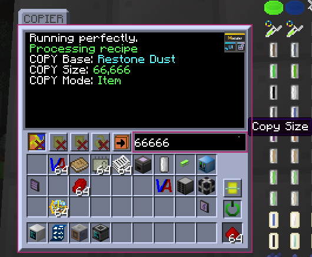
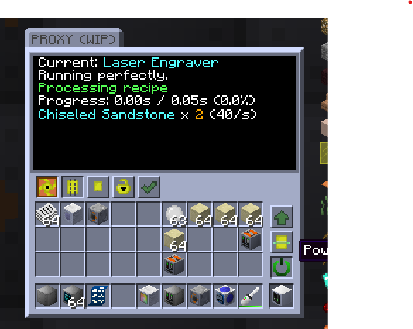
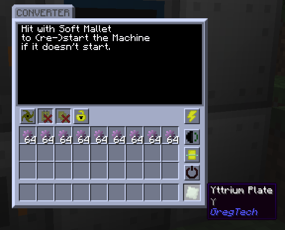
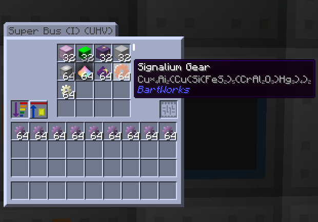
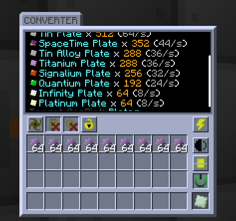
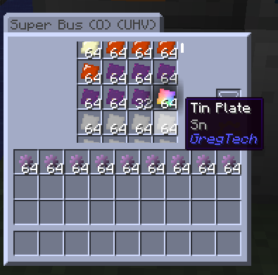

# Nyx: No Humans Left

English | [中文](README.zh.md)

This is a personal side mod I threw together after burning out on crafting the Star Gate in earlier runs.
After that, I just wanted to mess around, and this absurd mod happened.

This is a **cheat mod**. Balance and technical purity are not the goal here; having fun is.

Unofficial [Pre-Release builds](https://github.com/RhNu/GTNH-Nyx/releases/tag/edge-build) are usually used for
testing, in-progress development, or temporary packaging for GTNH Beta versions before an official GTNH release.

> [!NOTE]
> As stated above, this mod is not built for balance.
> If you are looking for a balanced experience, please do not use this mod.
>
> Have fun!

## Features

Some features may need to be enabled in `config\Nyx\*.cfg`.

- A simple material system that may be expanded in the future.

- Mixin edits: See `MIXIN.cfg` for more details. Mainly targets AE and BartWorks (now in GT5U).

- COPIER: Duplicate items in the controller

  **Config: `MTE_COPIER`**

> The button switches between item mode and fluid mode.
> Item mode copies items in the controller, while fluid mode copies fluids from the cell item in the controller.
>
> The text field sets the amount of items or fluids to copy.
>
> The machine runs once every 5 seconds by default. You can change this with `MTE_COPIER_TICK` in config.

- PROXY: Run machines through their RecipeMap

  **Config: `MTE_PROXY`**

> Note: This is intended for "simple" machines that work without special conditions or custom processing.
> The processing behavior is roughly what you see in NEI.

> Parallel limit is controlled by the number of machines in the controller.
> Formula: `amount ^ (log10(Integer.MAX_VALUE) / log10(64))`, simplified as `amount ^ 3.98`.
> So, 1 machine = 1 parallel, and 64 machines = Integer.MAX_VALUE parallel.

- CONVERTER: Convert items between different OreDict entries (e.g. ingotCopper <-> plateCopper).

  **Config: `MTE_CONVERTER`**

<table>
  <tr>
    <td></td>
    <td></td>
  </tr>
  <tr>
    <td></td>
    <td></td>
  </tr>
</table>

> Put an item representing the target OreDict in the controller.
> Input the item you want to convert, and the machine outputs the converted result.

### Note: About ID Conflicts

I do not know how other personal mods allocate MTE IDs. If conflicts happen, you can adjust the ID offset in
`config\Nyx\MACHINE.cfg`, then restart the game. The log output will also show the exact ID conflict target.

The mods and versions below had no conflicts when I updated Nyx to 2.7.3:

| Mod                                                                              | Version        |
| :------------------------------------------------------------------------------- | -------------- |
| [Twist-Space-Technology-Mod](https://github.com/Nxer/Twist-Space-Technology-Mod) | 0.6.14         |
| [BoxPlusPlus](https://github.com/RealSilverMoon/BoxPlusPlus)                     | 1.9.3          |
| [Programmable-Hatches-Mod](https://github.com/reobf/Programmable-Hatches-Mod)    | v0.1.2p28-beta |
