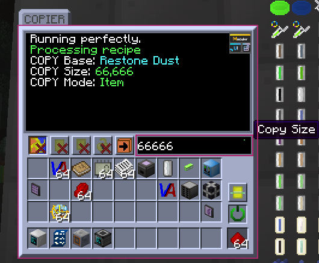

# Nyx: Balance-less GTNH Experience

English | [中文](README-ZH.md)

Currently WIP.

A random modification of the GT:NH mod-pack, created out of the tiredness of crafting the Star Gate on my previous runs.

This is more like a **cheat mod**. Technical skills and balances are out of mind, as long as I enjoy playing with it.

> [!NOTE]
> As I stated above, this mod is not meant to be balanced.
> If you are looking for a balanced experience, please do not use this mod.
>
> Have fun!

## Features

Features may need to be enabled in the `nyx.cfg` config file.

- Some kind of simple material system, to be used in the future.

- Added wireless lasers for IV~UMV, and easy recipes for all wireless energy. **Enable in config `RECIPE_EASY_WIRELESS`**

- COPIER: Copy Things in the controller

> The button is used to switch mode between item and fluid.
> The item mode can copy items in the controller, and the fluid mode refers to the cell item in the controller.
>
> The text field is used to set the amount of items or fluids to be copied.
>
> The machine works every 5 seconds, can be changed by `MTE_COPIER_TICK` in config.

### Note: About ID Conflicts

I don't know how other self-made mods take MTE IDs, the only thing I can do is to give a config file used
to change ID offset of this mod. If you have ID conflicts, please change the offset in `config/nyx.cfg`,
and restart the game. The log I set will also show the ID conflicts.

By the time I updated to 2.7.3, community mods below I have tested and made compatible with Nyx:
Twist Space Technology

| Mod                                                                              | Version        |
|:---------------------------------------------------------------------------------|----------------|
| [Twist-Space-Technology-Mod](https://github.com/Nxer/Twist-Space-Technology-Mod) | 0.6.14         |
| [BoxPlusPlus](https://github.com/RealSilverMoon/BoxPlusPlus)                     | 1.9.3          |
| [Programmable-Hatches-Mod](https://github.com/reobf/Programmable-Hatches-Mod)    | v0.1.2p28-beta |
| [AE2Things](https://github.com/asdflj/AE2Things)                                 | 1.1.8          |
